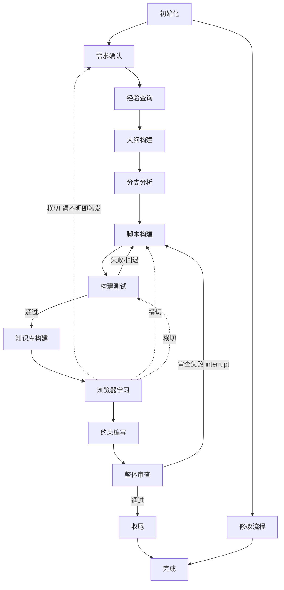

# 流程复刻 · general-programming（13 节点 + 修改路径）

复刻源：SKILL.md「执行路径」+ branch/流程/流程.md（创建路径 13 节点 / 修改路径 3 节点）。

## 节点表（13）

| # | 节点 | 细则目录 | 脚本 | dependence 声明 |
|---|---|---|---|---|
| 1 | 初始化 | 初始化/ | scaffold_project | git |
| 2 | 需求确认 | 需求确认/ | flowchart_helper | code-guidelines |
| 3 | 经验查询 | 经验查询/ | logic_chain | — |
| 4 | 大纲构建 | 大纲构建/ | flowchart_helper | — |
| 5 | 分支分析 | 分支分析/ | deps_check | python / git |
| 6 | 脚本构建 | 脚本构建/ | sandbox | code-guidelines / pavedpath-code |
| 7 | 构建测试 | 构建测试/ | run_tests / lint_check | python |
| 8 | 知识库构建 | 知识库构建/ | knowledge_fetch / knowledge_convert | file_ops（:grant network） |
| 9 | 浏览器学习 | 浏览器学习/ | browser_learn | file_ops（ff_lite search/fetch） |
| 10 | 约束编写 | 约束编写/ | check_links | — |
| 11 | 整体审查 | 整体审查/ | logic_chain debate | 全部薄技能 |
| 12 | 收尾 | 收尾/ | garbage_collect / context_compress | git |
| 13 | 完成 | 收口返回调度方整合 | — | — |

## 修改路径（独立·不与创建路径交织）

初始化 → 修改流程 → 完成（细则 branch/流程/修改流程/修改流程.md；penalty 重试 10 次熔断回退）。

> 专项缺口按 dependence 索引派发 ui-design / database-management / concurrency-design：只传「意图+参数」，本体不内嵌其正文。
